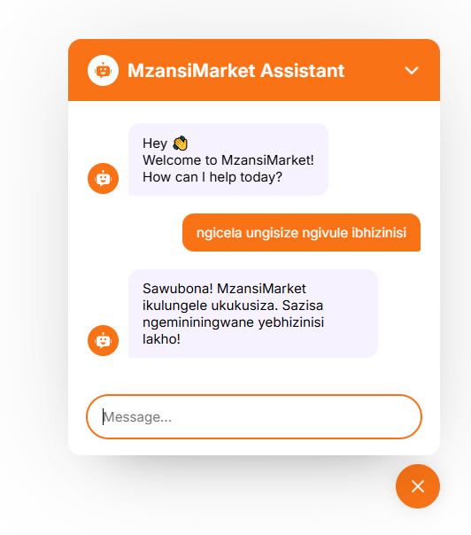

# MzansiMarket AI Chatbot

**Democratizing E-commerce Through Intelligent AI Assistance**

An AI-powered chatbot that breaks down barriers to online commerce by providing multilingual support, simplified navigation, and personalized guidance for emerging market users.

## 📸 Screenshot



_Responsive chatbot overlay with clean UI and real-time AI responses_

## 🌍 Impact & Innovation

### Bridging the Digital Divide

- **Language Accessibility** - Multi-language support for diverse African communities
- **Simplified UX** - Conversational interface removes complex navigation barriers
- **Trust Building** - AI-powered product explanations and purchase guidance
- **Mobile-First** - Optimized for smartphone users in bandwidth-limited environments

### Key Differentiators

🚀 **Smart Product Discovery** - Natural language search that understands local context and slang

🛡️ **Trust & Safety** - AI-powered fraud detection and seller verification explanations

💡 **Financial Inclusion** - Payment method guidance and mobile money integration support

## 🎯 **Personalized Recommendations** - AI learns user preferences to surface relevant local products

**Problem**: 60% of African consumers abandon e-commerce sites due to complex interfaces and language barriers

**Solution**: Conversational AI that transforms any e-commerce platform into an accessible, trust-building experience

**Market**: 400M+ underserved digital commerce users across emerging markets

## 🚀 Quick Start

### Prerequisites

- Node.js (v16+)
- Google Gemini API key ([Get one here](https://makersuite.google.com/app/apikey))

### Setup

1. **Clone and install:**

```bash
git clone https://github.com/telkom-10x-devs/mzansimarket-ai-support.git
cd mzansimarket-ai-support

# Frontend
cd client && npm install

# Backend
cd server && npm install
```

2. **Environment setup:**
   Create `server/.env`:

```bash
GEMINI_API_KEY=your_api_key_here
GEMINI_API_URL=https://generativelanguage.googleapis.com/v1beta/models/gemini-1.5-flash:generateContent
FRONTEND_URL=http://localhost:5173
PORT=8000
```

3. **Run:**

```bash
# Backend
cd server && npm run dev

# Frontend (new terminal)
cd client && npm run dev
```

Visit http://localhost:5173

## 🔧 Usage

1. Click the chat icon to open
2. Type your message and press Enter
3. Wait for AI response

## 🐛 Troubleshooting

**"[object Object]" error:** Check server logs, ensure API key is correct

**404 Model error:** Use `gemini-1.5-flash` instead of `gemini-pro`

**CORS errors:** Ensure `FRONTEND_URL` matches your frontend URL

**API key issues:**

- Must start with `AIzaSy`
- No spaces in .env file
- Restart server after changes

## 📁 Structure

```
├── client/src/
│   ├── ChatBotOverlay/
│   |   └── chatComponents/
|   |   |   └── ChatForm.jsx
|   |   |   └── ChatMessage.jsx
|   |   |   └── ChatbotIcon.jsx
|   |   └── ChatOverlay.jsx # Main chatbot file
|   └── App.jsx
|
├── server/
    └── server.js
```

## 🛡️ Security

- Keep API key in backend .env only
- Never expose API key in frontend
- Generate new API key if accidentally exposed

---

**Tech Stack:** React, Node.js, Express, Google Gemini AI
